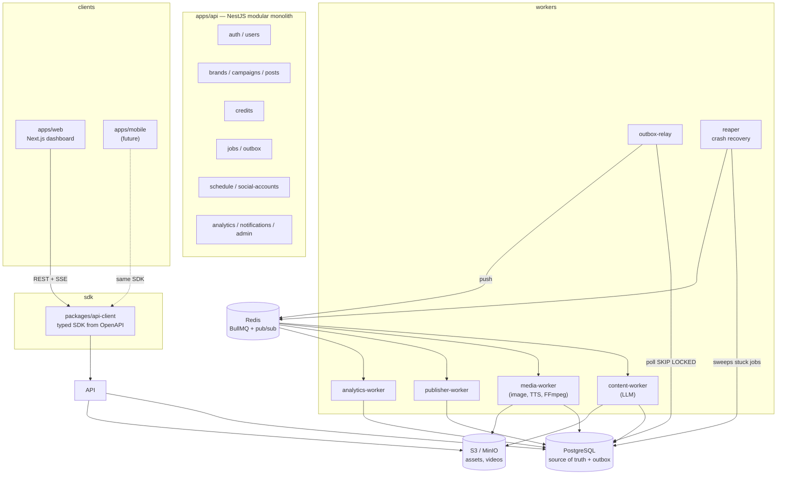

# RenderFlow

AI marketing studio and social scheduler. A business sets up a brand and a campaign
goal; AI produces captions, posters and short reels; the user approves, and a worker
publishes to social platforms on schedule. Usage is credit based — new accounts get
**50 free credits**, credits are reserved before work starts and refunded if
generation fails.

> **Status: Phase 0 (foundation) complete.** The monorepo, toolchain, shared
> libraries, app skeletons and CI are in place. Domain modules, the credit engine
> and the job pipeline arrive in Phases 1+. See `PROJECT.md` §12 for the plan and
> §13 for the test matrix.

---

## Architecture

**Modular monolith (NestJS) + separate worker processes, connected by Redis/BullMQ
and a transactional outbox.** Not microservices: credits need atomic DB transactions,
and one deployable is far easier to demo and reason about.



### Why this shape

| Decision                            | Reason                                                                                                                                                  |
| ----------------------------------- | ------------------------------------------------------------------------------------------------------------------------------------------------------- |
| Modular monolith, not microservices | Credits need multi-statement transactions and a single schema. Modules communicate via events, so any of them can be extracted later without a rewrite. |
| Separate worker _processes_         | Rendering and LLM calls are slow and bursty. Keeping them out of the API request path is what lets the API stay responsive and scale independently.     |
| Transactional outbox                | A DB write and its event commit together. `outbox-relay` pushes to BullMQ afterwards. If Redis is down, events wait in Postgres instead of being lost.  |
| Redis is never the source of truth  | Schedules and job state are persisted in Postgres, so Redis loss is recoverable.                                                                        |
| Shared typed SDK                    | `apps/web` and any future mobile app consume one generated client, so neither can drift from the API contract.                                          |

---

## Repository layout

```
apps/
  web/                  Next.js dashboard (App Router)
  api/                  NestJS modular monolith — all HTTP
  content-worker/       LLM tasks
  media-worker/         image, TTS, FFmpeg
  publisher-worker/     social publishing
  analytics-worker/     metrics sync
  outbox-relay/         outbox → BullMQ
  reaper/               stuck-job recovery + reconciliation
libs/
  common/               DTOs, enums, event contracts, zod schemas, queue names
  db/                   Prisma client + migrations
  queue/                BullMQ factories, retry presets
  storage/              S3 abstraction
  observability/        pino logger, prometheus metrics, process lifecycle
packages/
  api-client/           typed SDK generated from the API OpenAPI document
tests/                  e2e, integration, chaos
infra/                  docker, grafana, prometheus, scripts
```

Dependencies flow one way: `apps/* → libs/*` and `packages/*`, never the reverse.
Apps never import each other; they share `libs/common` or talk over queues.

---

## Getting started

### Prerequisites

- Node **22+** (tested on 24)
- pnpm **12+** (via `corepack enable`)
- Docker with Compose v2

### Setup

```bash
pnpm install
cp .env.example .env
docker compose up -d postgres redis minio minio-init mailhog
pnpm db:migrate
pnpm build
```

### Run

```bash
pnpm dev          # all apps via turbo
docker compose up --build   # full stack
```

| Service       | URL                                                 |
| ------------- | --------------------------------------------------- |
| Web dashboard | http://localhost:3000                               |
| API           | http://localhost:4000/api/v1                        |
| Health        | http://localhost:4000/health/live · `/health/ready` |
| Metrics       | http://localhost:4000/metrics                       |
| MinIO console | http://localhost:9001                               |
| MailHog       | http://localhost:8025                               |
| Grafana       | http://localhost:3001                               |

### Commands

```bash
pnpm lint          # eslint (type-aware, strict)
pnpm typecheck     # tsc --noEmit across the workspace
pnpm test          # unit
pnpm test:coverage # unit + coverage gates
pnpm test:int      # integration (Testcontainers) — from Phase 1
pnpm test:e2e      # Playwright against the compose stack — from Phase 8
pnpm test:chaos    # tests/chaos/run.sh — from Phase 5
pnpm format        # prettier
```

---

## The credit system

Credits are the part of this project worth reading first.

1. **Signup grants 50 credits**, once per user, in the same transaction that creates
   the user. A unique constraint on `(user_id, 'SIGNUP_BONUS')` makes a duplicate
   grant impossible.
2. **Wallet = `available` + `reserved`**, both integers with a `CHECK (>= 0)`.
3. **Reserve before work.** Credits move `available → reserved` atomically with job
   creation and an outbox event, in one transaction. Insufficient balance means HTTP
   `402 INSUFFICIENT_CREDITS` and _nothing is created_.
4. **Capture on success** — `reserved` is released and the credits are spent.
5. **Refund on failure** — after retries are exhausted or on a permanent error,
   `reserved → available`, idempotent via `UNIQUE(reference_type, reference_id, entry_type)`.
6. **Only `libs/credits` may write to `wallets` or `credit_ledger`.** No other module
   runs SQL against those tables.
7. **Every movement is an append-only ledger row.** Wallet columns are caches; an
   hourly `reconcile()` proves `available + reserved == SUM(ledger)`.

Pricing lives in the `pricing_rules` table, never in code and never on the client:

| Action                        | Credits |
| ----------------------------- | ------- |
| Content plan (7-day calendar) | 2       |
| Caption + hashtags set        | 1       |
| Poster / photo                | 5       |
| Carousel (up to 5 images)     | 15      |
| Reel ≤ 15 s                   | 30      |
| Reel 16–30 s                  | 50      |
| Regenerate one scene          | 8       |
| Caption translation           | 1       |

Publishing and scheduling are free. Only generation costs credits.

```
signup ──► available:50
reserve(30) ──► available:20, reserved:30
  success ──► reserved:0                  (CAPTURE)
  failure ──► available:50, reserved:0    (REFUND)
```

---

## Reliability mechanisms

The thesis of this system: **a crash at any point must never lose a job, double
charge, or double post.**

- **Transactional outbox** — DB write and event commit together; the relay publishes.
- **Heartbeat + lease** — a worker holds `locked_until = now() + 2m`, renewed every 30 s.
- **Reaper** (leader-locked, every 60 s) — recovers expired leases, re-enqueues
  orphaned `PENDING` jobs, reconciles `PUBLISHING` jobs against the platform.
- **Checkpointing** — each stage writes to S3 and `job_checkpoints`; a retry resumes at
  the first incomplete stage instead of redoing expensive work.
- **Idempotency at three levels** — `Idempotency-Key` on requests, unique keys on
  ledger rows, and an `external_post_id` check before any publish is retried.
- **DLQ + admin replay** — exhausted jobs are inspectable and replayable.
- **Graceful shutdown** — SIGTERM drains in-flight work before exit.
- **Token safety** — social tokens encrypted at rest (AES-256-GCM), never logged.

---

## Chaos testing

`tests/chaos/run.sh` automates scenarios R1–R11 (`PROJECT.md` §13.3): killing
`media-worker` mid-render, stopping Redis mid-job, duplicate delivery, two reapers
racing, publisher killed after the platform accepted a post. Each scenario prints
PASS/FAIL and leaves the system clean. Lands in Phase 5.

```bash
pnpm test:chaos
```

---

## Testing

| Layer       | Tool                  | Scope                                          |
| ----------- | --------------------- | ---------------------------------------------- |
| Unit        | Jest                  | credit math, state machines, pricing, adapters |
| Integration | Jest + Testcontainers | real Postgres/Redis; credit and queue logic    |
| Concurrency | Jest + `Promise.all`  | races on credits and publishing                |
| Chaos       | Bash + Docker         | worker kill, Redis/DB restart, SIGTERM         |
| E2E         | Playwright            | real user journeys against compose             |
| Load        | k6                    | throughput, queue drain time                   |

Gates: `libs/credits` and the state machines ≥ 95 %, overall ≥ 80 %. Mocks are used
for every external API — tests never call a real provider.

Current: **217 unit tests passing**, 87 % lines / 82.8 % branches overall.

---

## Configuration

Copy `.env.example` to `.env`. Notable values:

| Variable                   | Default             | Purpose                                   |
| -------------------------- | ------------------- | ----------------------------------------- |
| `AI_PROVIDER`              | `mock`              | `mock` \| `anthropic` \| `openai`         |
| `IMAGE_PROVIDER`           | `mock`              | `mock` \| `replicate` \| `fal`            |
| `TTS_PROVIDER`             | `mock`              | `mock` \| `elevenlabs` \| `openai`        |
| `SIGNUP_BONUS_CREDITS`     | `50`                | free credits at signup                    |
| `FAIL_STAGE` / `FAIL_RATE` | –                   | mock-provider failure injection for tests |
| `S3_ENDPOINT`              | `http://minio:9000` | S3/MinIO                                  |

Local development and CI run entirely on mocks.

---

## License

Private project.
